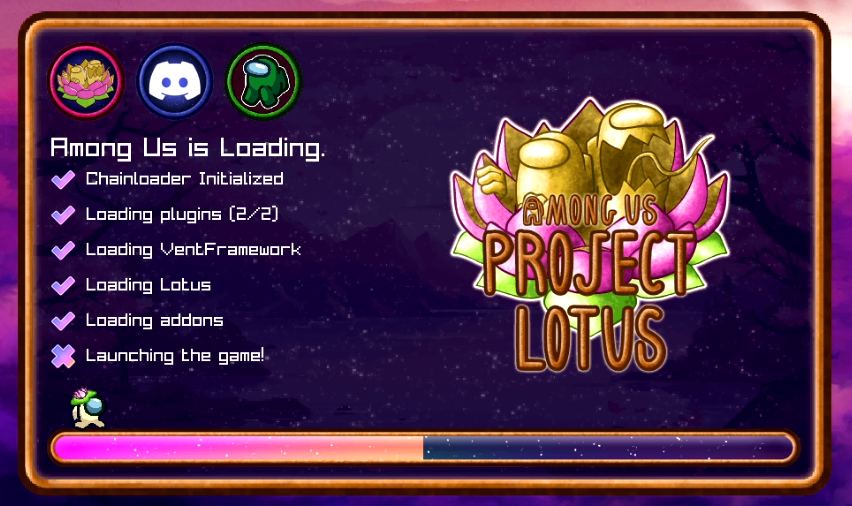

# Lotus.SplashScreen
A reimagining of BepInEx.SplashScreen specifically themed for Project: Lotus

---

| Preview  |
|:--------:|
|  |

---

### For Developers:
There's a version of this without the Lotus specific theme and content, which I highly recommend using instead of this.

You can find it at the following link: (to be added)

If you do wish to use the version in this repository, note that it isn't very customizable (other than assets).

---

### Credits:
- [BepInEx.SplashScreen](https://github.com/BepInEx/BepInEx.SplashScreen) - Original Splash Screen for BepInEx. Some code is used from there (kind of unavoidable). 
- **Lazy/Piggy B** - Artist for most of the assets featured.
- [DPAnimating](https://www.youtube.com/@dpanimating) - Made the little lotus hat on the mini-crewmate.

**This project is licensed under the GNU General Public License v3.0. See the LICENSE file for more details.**
